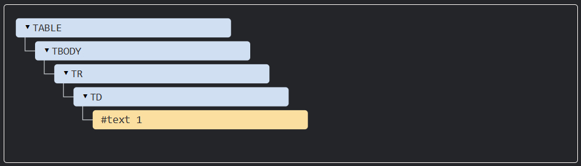

> 如果你在寫程式碼時，這個功能是為了**「改變畫面上看得見的結構」，那就是 DOM；如果這個功能是為了「跟瀏覽器或系統互動」**，那就是 BOM。


# `<tbody>`
- table is a funny things,according to the rules of DOM,it should have `<tbody>` tag,but the html will ignore it.
```html
<table id="table"><tr><td>1</td></tr></table>
```

The structure of DOM will be:



# Navigation things


## `id` property

- `id` need to be unique,if there are more than one component have the same id,the behavior of `document.getElementById` will be unpredictable.

## `querySelectorAll()` `querySelector()` `matches()`